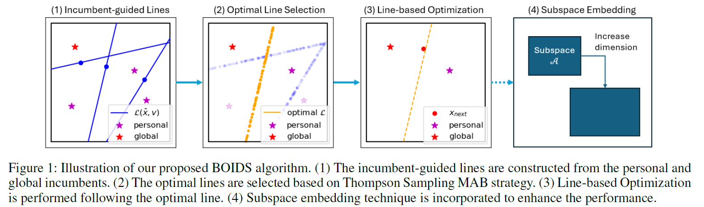

## Overview

Implementation code for paper ***BOIDS: High-dimensional Bayesian Optimization via Incumbent-guided Direction Lines and Subspace Embeddings*** pulished in *The 39th Annual AAAI Conference on Artificial Intelligence (AAAI-2025)*. The manuscript will be added soon.



If you find our paper or this repo to be useful for your research, please consider citing:
```
@inproceedings{ngo2025boids,
  title={BOIDS: High-dimensional Bayesian Optimization via Incumbent-guided Direction Lines and Subspace Embeddings},
  author={Ngo, Lam and Ha, Huong and Chan, Jeffrey and Zhang, Hongyu},
  booktitle={Proceedings of the AAAI Conference on Artificial Intelligence},
  year={2025}
}
```

## Requirement and dependencies
- Install Miniconda.
- Install all dependencies listed in ```environment.yml``` file, or run the following to install via conda:
```
conda env create -f environment.yml
```
- If you want to run Lasso Benchmark, install the LassoBench library by:
```
cd test_functions/
pip install -e .
```
## Getting started
The main file is ```test-boids.py```. To run the code for any problem, use the following syntax:
```
python test-boids.py -f <function_name> -d <input_dim> -n <number_of_iterations>
```
The above command only list required arguments. Please check the following table for optional arguments, as well as possible values for each arguments.

| Flag &nbsp; &nbsp; &nbsp; &nbsp; &nbsp; &nbsp;| Description |
| --- | --- | 
| -f | A string for objective function, e.g., ackley, branin500, hartmann500, mopta, lasso-dna, half-cheetah, etc. See ```test_functions/utils.py``` for more options. |
| -d | An integer to specify the objective function input dimensionality. Only works for scalable synthetic functions, e.g., ackley, alpine, levy. See ```test_functions/utils.py``` for more options. |
| -n | An integer to specify to iteration budget. |
| -a | (Optional) A string for the acquisition function, e.g., ```ts```, ```ei```, ```ucb```, ```logei```. Default is ```ts``` |
| -m | (Optional) An integer to specify the number of particles (population of PSO swarm). Default is ```20```. |
| -w | (Optional) A float to specify the inertia parameter. Default is ```0.729```. |
| -c1 | (Optional) A float to specify the cognitive parameter. Default is ```2.05*0.729```. |
| -c2 | (Optional) A float to specify the social parameter. Default is ```2.05*0.729```. |
| --output | (Optional) A string to specify the output folder. Output will be exported to the folder as a pickle file. Default is ```/output```. |
| --seed | (Optional) An integer to specify the random seed for random number generator. Default is ```1```. |


## Results from paper
To produce the main experimental results in the paper (Fig. 2), run the bash file ```experiments-from-paper.sh```.

# Acknowledgements

This code implementation uses materials from the following public repositories to implemenent the subspace embedding. We thank the respective repository maintainers.
1. BAxUS: Papenmeier, L., Nardi, L., & Poloczek, M. (2022). Increasing the scope as you learn: Adaptive Bayesian optimization in nested subspaces. Advances in Neural Information Processing Systems, 35, (NeurIPS).
   Code repo: https://github.com/LeoIV/BAxUS